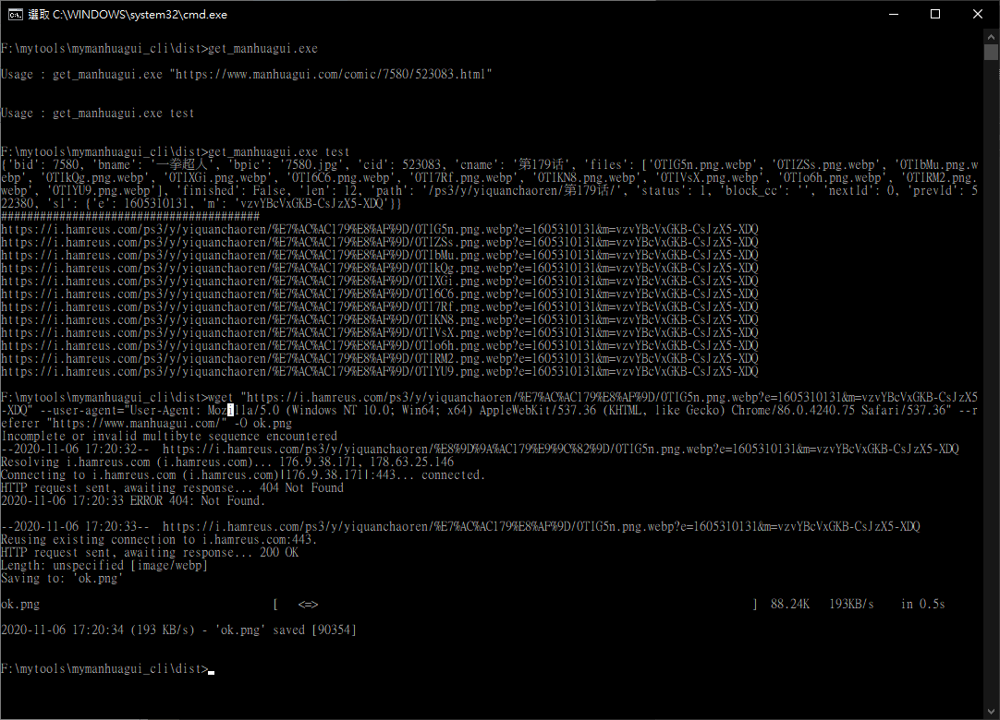

# mymanhuagui_cli
<h2>cli 模式抓 manhuagui 方法</h2>
<h3>Major Author : wzdlc1996</h3>
<h3>Author : 羽山 https://3wa.tw/</h3>
<h3>Version : 2020-11-06</h3>
 

直接下語法抓 manhuagui 漫畫列表
 
<h3>使用方法：</h3>
cd dist 
get_manhuagui.exe 
get_manhuagui.exe test 
get_manhuagui.exe "https://www.manhuagui.com/comic/7580/523083.html" 

<h3>回應：</h3>
{metadata json} 
#################################### 
Page Link 
Page Link 
Page Link 
Page Link 
Page Link 
... 

<h3>下載範例：</h3>
wget "https://i.hamreus.com/ps3/y/yiquanchaoren/%E7%AC%AC179%E8%AF%9D/0TIG5n.png.webp?e=1605310131&m=vzvYBcVxGKB-CsJzX5-XDQ" --user-agent="User-Agent: Mozilla/5.0 (Windows NT 10.0; Win64; x64) AppleWebKit/537.36 (KHTML, like Gecko) Chrome/86.0.4240.75 Safari/537.36" --referer "https://www.manhuagui.com/"  -O ok.png
<h3>參考資料：</h3>
<ul>
  <li>1. https://github.com/wzdlc1996/mangaSpider</li>
  <li>2. https://wzdlc1996.github.io/artic/other/mangaspider/</li>
</ul>  